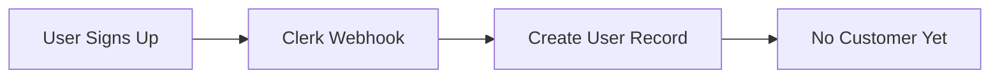
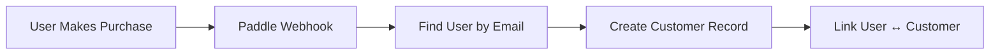

# User vs Customer Architecture Guide

## 🏗️ **New Architecture: Separation of Concerns**

### **Before** (Single Table):

```
Customer Table
├── customerId (Paddle ID)
├── clerkUserId (Auth ID)
├── email
└── subscriptions[]
```

### **After** (Two Tables):

```
User Table (Identity & Profile)        Customer Table (Billing & Payments)
├── id                                  ├── id
├── clerkUserId (Auth)                  ├── paddleCustomerId (Billing)
├── email                               ├── userId (FK to User)
├── firstName, lastName                 └── subscriptions[]
├── avatar
└── customer? (1:1 relation)
```

## 🎯 **Why This is Better**

### **Clear Domain Separation:**

- **User** = Authentication, profile, app usage
- **Customer** = Payments, subscriptions, billing

### **Business Logic:**

- **👥 All users get a User record** (even free users)
- **💳 Only paying users get a Customer record**
- **🔗 1:1 relationship** when user becomes customer

## 📊 **Data Flow**

### **User Signup/Login:**



### **First Purchase:**



## 🔧 **New Database Functions**

### **User Operations:**

```typescript
import { getUserByClerkId, upsertUser } from '@/utils/database/user';

// Get user with billing info
const user = await getUserByClerkId(clerkUserId);
console.log(user.customer?.subscriptions); // May be null for free users

// Create/update user profile
await upsertUser({
  clerkUserId: 'user_123',
  email: 'user@example.com',
  firstName: 'John',
  lastName: 'Doe',
  avatar: 'https://...',
});
```

### **Customer Operations:**

```typescript
import { createCustomer, getCustomerByUserId } from '@/utils/database/customer';

// Create customer when user first purchases
await createCustomer({
  userId: user.id,
  paddleCustomerId: 'ctm_123',
});

// Get customer with user info
const customer = await getCustomerByUserId(user.id);
```

## 🚀 **Migration Benefits**

### **1. Better Performance**

- Query only what you need
- Users table: Fast profile lookups
- Customers table: Only for billing operations

### **2. Scalability**

- Free users don't bloat billing table
- Easy to add user features (teams, preferences, etc.)
- Separate customer analytics

### **3. Data Integrity**

- Can't have customer without user
- Cascade delete protection
- Clear foreign key relationships

### **4. Feature Development**

```typescript
// Easy to add user features
model User {
  // ... existing fields
  preferences Json?
  teamId      String?
  lastActive  DateTime?
}

// Easy to add billing features
model Customer {
  // ... existing fields
  billingAddress Json?
  taxId          String?
  invoiceEmail   String?
}
```

## 🔄 **Common Patterns**

### **Get User with Billing Status:**

```typescript
const user = await getUserByClerkId(clerkUserId);
const hasSubscription = user.customer?.subscriptions.some((s) => s.subscriptionStatus === 'active');
const isFreeTier = !user.customer;
```

### **User Dashboard Data:**

```typescript
// Profile section - always available
const userProfile = {
  name: `${user.firstName} ${user.lastName}`,
  email: user.email,
  avatar: user.avatar,
};

// Billing section - conditional
const billingInfo = user.customer
  ? {
      subscriptions: user.customer.subscriptions,
      paddleCustomerId: user.customer.paddleCustomerId,
    }
  : null;
```

### **Freemium Logic:**

```typescript
export function canAccessFeature(user: UserWithCustomer, feature: string) {
  // Free users get basic features
  if (!user.customer) {
    return FEATURES.FREE.includes(feature);
  }

  // Paying customers get premium features
  const hasActiveSubscription = user.customer.subscriptions.some((s) => s.subscriptionStatus === 'active');

  return hasActiveSubscription && FEATURES.PREMIUM.includes(feature);
}
```

## 📝 **Migration Checklist**

- ✅ **Schema Updated** - User + Customer tables
- ✅ **Utilities Created** - Separate user/customer functions
- ✅ **Webhooks Updated** - Clerk creates users, Paddle creates customers
- ✅ **Relationships** - 1:1 User ↔ Customer with proper FKs
- ⏳ **Frontend Updates** - Update components to use new structure
- ⏳ **Database Migration** - Apply schema changes: `npm run db:push`

## 🚨 **Important Notes**

1. **Existing Data**: If you have existing data, you'll need a migration script
2. **Frontend**: Update any components that query customer data directly
3. **API**: Review API endpoints that return user/customer data
4. **Types**: Update TypeScript types to match new schema

This architecture sets you up for:

- 🎯 **Freemium models** (users without customers)
- 👥 **Team features** (multiple users per customer)
- 📈 **Better analytics** (user behavior vs billing behavior)
- 🔄 **Easier testing** (separate user and billing concerns)
